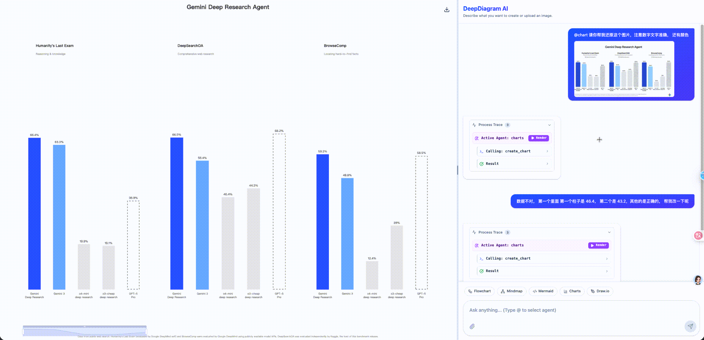
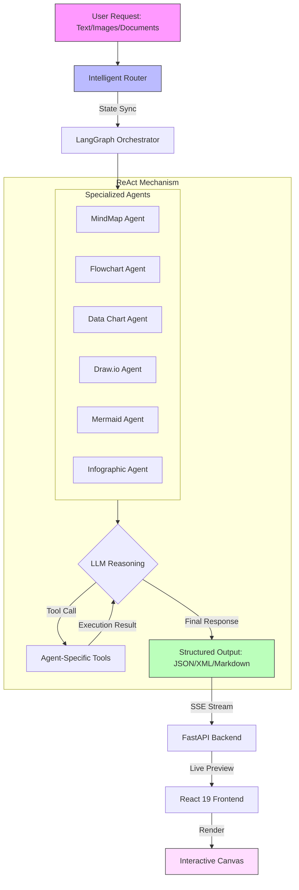

# DeepDiagram AI: Agentic AI Visualization Platform

**DeepDiagram AI** is an open-source, intelligent visualization platform that leverages **Agentic AI** and **multi-agent orchestration** to transform natural language and multimodal inputs into professional diagrams. Unlike traditional tools, DeepDiagram employs a **LangGraph-powered architecture** where specialized agents handle different visualization domains—from interactive mind maps to complex infographics.

**Demo: [http://deepd.cturing.cn/](http://deepd.cturing.cn/)**




---

## 🚀 Core Features

### 🧠 Mind Map Agent
- **Powered by**: `mind-elixir`
- **Capabilities**: Generates 4-5 level deep, structured, interactive mind maps in Markdown format
- **Use Cases**: Knowledge mapping, brainstorming, concept organization
- **Workflow**: Supports real-time preview, editing, and export to PNG


### 🔀 Flowchart Agent
- **Powered by**: `React Flow`
- **Capabilities**: Creates business process flows with intelligent auto-layout and custom node styling
- **Use Cases**: Business processes, logic flows, step-by-step procedures
- **Workflow**: Interactive canvas with drag-and-drop editing and high-quality image export


### 📊 Data Chart Agent
- **Powered by**: `Apache ECharts 6.0`
- **Capabilities**: Visualizes data using bar charts, line graphs, pie charts, gauges, and more with modern animations
- **Use Cases**: Data visualization, dashboards, trend analysis
- **Workflow**: Analyzes data or descriptions to generate rich, interactive ECharts configurations


### ✏️ Draw.io Agent
- **Powered by**: `Draw.io` (Atlas Theme)
- **Capabilities**: Produces professional-grade cloud architecture and network topology diagrams
- **Use Cases**: Cloud infrastructure, system architecture, technical blueprints
- **Workflow**: Advanced canvas with **auto-centering** and **sidebar concealment** for a focused drawing experience


### 🧜 Mermaid Agent
- **Powered by**: `Mermaid.js 11.12` + `react-zoom-pan-pinch`
- **Capabilities**: Generates text-driven diagrams including Sequence, Gantt, Timeline, State, Class, and ER diagrams
- **Use Cases**: Technical documentation, software design, project planning
- **Workflow**: Native interactive canvas with adaptive scaling, zoom/pan controls, and high-resolution SVG/PNG export


### 🎨 Infographic Agent
- **Powered by**: `AntV Infographic`
- **Capabilities**: Creates professional digital infographics, data posters, and visual summaries using declarative DSL
- **Use Cases**: Data storytelling, visual summaries, creative presentations
- **Workflow**: Rich built-in templates with high-quality SVG rendering


---

## ✨ Advanced Features

### 🤖 Intelligent Router & ReAct Orchestration
- **Context-Aware Routing**: Automatically routes requests to the optimal agent based on:
  - Explicit mentions (e.g., `@mindmap`, `@flow`)
  - LLM intent recognition with full agent capability descriptions
  - Conversation context (prefers last active agent for continuity)
- **ReAct Mechanism**: Each agent operates in a Reasoning-Acting loop, calling tools iteratively until task completion
- **Multimodal Support**: Upload whiteboards, sketches, or technical diagrams for digitization

### 📜 Persistent History & Message Branching
- **Session Management**: Maintain multiple chat sessions with automatic state restoration (including diagrams and process traces)
- **Message Branching**: Retry assistant responses to explore different visualization paths; navigate between versions via built-in pagination
- **Version Control**: Git-like branching system with `turn_index` and `parent_id` tracking
- **Robust Storage**: PostgreSQL-backed persistence ensures reliability for complex technical traces and multimodal content

### 📄 Intelligent Document Analysis
- **Deep Content Understanding**: Automatically parses uploaded documents (PDF, DOCX, XLSX, PPTX, TXT, MD) with:
  - Concurrent chunking for large files
  - LLM extraction of temporal data, key entities, and relationships
  - Structured information retrieval
- **Persistent Memory**: Analysis results are database-persisted, allowing AI to retain context across sessions
- **Time-Aware**: All agents are aware of the current date/time for accurate timeline generation and scheduling

### 🎯 Real-Time Streaming & Process Trace
- **SSE Live Preview**: Server-Sent Events stream thinking processes and code generation in real-time
- **Execution Trace Visualization**:
  - Agent selection tracking
  - Tool call input/output logging
  - Streaming code generation with syntax highlighting
  - Contextual "Render" and "Retry" actions
- **Error Handling**: Clear visual feedback for rendering failures with instant retry capability

### 🎨 Modern UI/UX Enhancements
- **Resizable Layout**: Flexibly adjust canvas and chat panel widths using a draggable separator
- **Responsive Design**: All tables and components adapt to container size without layout breaks
- **Visual Loading States**: Clear feedback during history loading, document parsing, and content generation
- **Accessibility**: Keyboard shortcuts, hover tooltips, and status indicators

---

## 🏗 System Architecture

DeepDiagram AI uses a **React 19 + FastAPI** architecture, orchestrated by **LangGraph**. Updates are streamed to the frontend via **SSE (Server-Sent Events)** for a live preview experience.



### Key Components

**Backend (Python)**
- `dispatcher.py`: Intent-based routing with explicit tags and LLM fallback
- `graph.py`: LangGraph state machine defining agent orchestration
- `file_service.py`: Concurrent document parsing and LLM extraction
- `chat.py`: Session and message CRUD with branching support
- SQLModel ORM with async PostgreSQL driver

**Frontend (React)**
- `ChatPanel.tsx`: Message history, input handling, execution trace rendering
- `CanvasPanel.tsx`: Dynamic agent component loading and rendering
- `chatStore.ts`: Zustand state management for messages, sessions, and versions
- Agent-specific renderers: `MindmapAgent`, `FlowAgent`, `MermaidAgent`, etc.

---

## 🛠 Tech Stack

### Frontend
- **Framework**: React 19 (concurrent rendering), Vite, TypeScript
- **Styling**: TailwindCSS 4.1.17
- **State Management**: Zustand 5.0.9
- **Visualization**:
  - React Flow 11.11.4 (flowcharts)
  - Mind-elixir 5.3.8 (mind maps)
  - Mermaid 11.12.2 (technical diagrams)
  - ECharts 6.0.0 (data charts)
  - AntV Infographic 0.2.6 (infographics)
- **UI Components**: Lucide React (icons), react-resizable-panels, react-zoom-pan-pinch
- **Markdown**: React Markdown + remark-gfm

### Backend
- **Framework**: Python 3.13, FastAPI (async), Uvicorn (ASGI)
- **AI Orchestration**: LangGraph 1.0.4, LangChain 1.1.3, langchain-openai
- **Database**: PostgreSQL 16, SQLModel 0.0.27 (ORM), asyncpg (driver)
- **Document Processing**: PyMuPDF 1.25.3 (PDF), python-docx, python-pptx, pandas + openpyxl
- **Package Manager**: uv (ultra-fast Python package manager)

### DevOps
- **Containerization**: Docker, Docker Compose (multi-container orchestration)
- **Web Server**: Nginx (reverse proxy, static file serving)
- **CI/CD**: GitHub Actions (automated Docker image builds)

---

## 🏁 Getting Started

### Prerequisites
- **Python**: 3.10+ (3.13 recommended)
- **Node.js**: v20+
- **Docker & Docker Compose**: Recommended for production
- **API Keys**: OpenAI-compatible API (OpenAI, DeepSeek, or custom providers)

### Option 1: Development Setup

#### 1. Backend Setup
```bash
cd backend
uv sync                # Install dependencies via uv
bash start_backend.sh  # Runs DB migrations + starts FastAPI server
```
Backend runs on `http://localhost:8000`

#### 2. Frontend Setup
```bash
cd frontend
npm install
npm run dev
```
Frontend runs on `http://localhost:5173`

### Option 2: Docker Deployment (Recommended)

#### 1. Configuration
Create a `.env` file in the project root:
```env
# LLM Configuration
OPENAI_API_KEY=sk-your-openai-key
OPENAI_BASE_URL=https://api.openai.com/v1
MODEL_ID=claude-sonnet-3.7

# Alternative: DeepSeek
DEEPSEEK_API_KEY=sk-your-deepseek-key
DEEPSEEK_BASE_URL=https://api.deepseek.com

# Database (auto-configured in Docker Compose)
DATABASE_URL=postgresql+asyncpg://postgres:postgres@db:5432/deepdiagram

# Optional: Thinking verbosity (concise/normal/verbose)
THINKING_VERBOSITY=normal
```

#### 2. Launch
```bash
docker-compose up -d
```

Services:
- **Frontend**: http://localhost (Nginx on port 80)
- **Backend API**: http://localhost/api (proxied by Nginx)
- **Database**: PostgreSQL on port 5432 (internal)

#### 3. Verify Deployment
```bash
docker-compose ps               # Check running services
docker-compose logs -f backend  # View backend logs
```

### Option 3: Custom LLM Provider

DeepDiagram supports any OpenAI-compatible API endpoint. Configure via `.env`:
```env
OPENAI_BASE_URL=https://your-custom-endpoint.com/v1
OPENAI_API_KEY=your-api-key
MODEL_ID=your-model-name
```

Or configure interactively in the UI:
1. Click the Settings icon in the top-right corner
2. Add a new model configuration with Name, Base URL, Model ID, and API Key
3. Select your custom model from the dropdown

---

## 📖 Usage Guide

### Basic Workflow
1. **Natural Language Input**: Type requests like "Create a mind map for AI history" or "@flow design a user authentication process"
2. **Multimodal Upload**: Attach images (whiteboards, sketches) or documents (PDF, DOCX) for context
3. **Interactive Canvas**: Resize panels, zoom/pan diagrams, edit content
4. **Export**: Download diagrams as PNG or SVG via the canvas toolbar
5. **Refine**: Ask AI to modify results (e.g., "Add a timeline branch for Industry 4.0")

### Advanced Features
- **Retry with Branching**: Click the retry icon to generate alternative versions
- **Version Navigation**: Use left/right arrows to switch between message versions
- **Session Management**: Create new chats or load previous sessions from the History dropdown
- **Process Trace**: Expand "Process Trace" to view agent selection and tool call details

---

## 🗺 Roadmap

- [x] MVP with 6 Core Agents (MindMap, Flow, Charts, Draw.io, Mermaid, Infographic)
- [x] LangGraph-based ReAct Orchestration
- [x] Intelligent Router with Context-Awareness
- [x] Resizable Dashboard Layout
- [x] Persistent Session & Chat History
- [x] Message Branching & Versioning
- [x] Multimodal Document Analysis (PDF, DOCX, XLSX, PPTX)
- [x] SSE Real-Time Streaming
- [x] Execution Trace Visualization
- [x] UI/UX Polishing (Responsive Tables, Loading States)
- [ ] Collaborative Editing (Real-time Sync via WebSockets)
- [ ] Custom Agent Plugin System
- [ ] Advanced Export Options (PowerPoint, Word)

---

## 🤝 Contributing

Contributions are welcome! Please follow these guidelines:

1. Fork the repository
2. Create a feature branch (`git checkout -b feature/amazing-feature`)
3. Commit your changes (`git commit -m 'Add amazing feature'`)
4. Push to the branch (`git push origin feature/amazing-feature`)
5. Open a Pull Request

### Development Tips
- Use `uv` for Python dependency management (faster than pip)
- Follow the existing code style (Black for Python, Prettier for TypeScript)
- Add tests for new features
- Update documentation as needed

---

## ⭐ Star History

[](https://www.star-history.com/#twwch/DeepDiagram&type=date&legend=top-left)

---

## 📄 License

This project is licensed under the **GNU Affero General Public License v3.0 (AGPL-3.0)**. See the [LICENSE](LICENSE) file for details.

Key points:
- ✅ Free to use, modify, and distribute
- ✅ Must disclose source code for derivative works
- ✅ Must use the same AGPL-3.0 license for derivatives
- ⚠️ Network use counts as distribution (must share source)

---

## 📞 Support & Community

- **Issues**: [GitHub Issues](https://github.com/twwch/DeepDiagram/issues)
- **Discussions**: [GitHub Discussions](https://github.com/twwch/DeepDiagram/discussions)
- **Demo**: [http://deepd.cturing.cn/](http://deepd.cturing.cn/)

Made with ❤️ by the DeepDiagram Team
