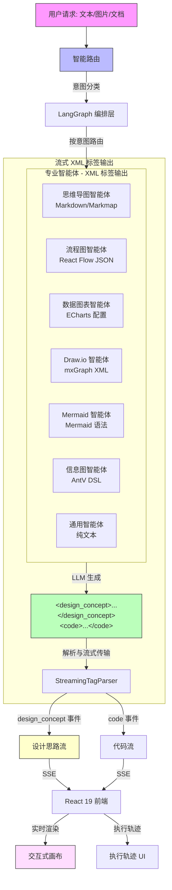

# DeepDiagram AI: 智能 AI 可视化平台

**DeepDiagram AI** 是一个开源的智能可视化平台，利用 **Agentic AI（智能体 AI）** 和**多智能体编排技术**，将自然语言和多模态输入转换为专业图表。与传统工具不同，DeepDiagram 采用了基于 **LangGraph 的架构**，由专门的智能体处理不同的可视化领域——从交互式思维导图到复杂的信息图表。

**项目体验地址: [http://deepd.cturing.cn/](http://deepd.cturing.cn/)**


---

## 🚀 核心功能

### 🧠 思维导图智能体 (Mind Map Agent)
- **核心驱动**: `mind-elixir`
- **能力**: 生成 4-5 层深度的结构化交互式思维导图，使用 Markdown 格式
- **应用场景**: 知识结构梳理、头脑风暴、概念组织
- **工作流**: 支持实时预览、编辑和导出为 PNG


### 🔀 流程图智能体 (Flowchart Agent)
- **核心驱动**: `React Flow`
- **能力**: 创建业务流程图，具有智能自动布局和自定义节点样式
- **应用场景**: 业务流程、逻辑流程、分步骤操作
- **工作流**: 交互式画布，支持拖拽编辑和高质量图像导出


### 📊 数据图表智能体 (Data Chart Agent)
- **核心驱动**: `Apache ECharts 6.0`
- **能力**: 使用柱状图、折线图、饼图、仪表盘等多种图表可视化数据，配有现代动画效果
- **应用场景**: 数据可视化、仪表盘、趋势分析
- **工作流**: 分析数据或描述，生成丰富的交互式 ECharts 配置


### ✏️ Draw.io 智能体
- **核心驱动**: `Draw.io` (Atlas 主题)
- **能力**: 生成专业级云架构和网络拓扑图
- **应用场景**: 云基础设施、系统架构、技术蓝图
- **工作流**: 高级画布，具有**自动居中**和**侧边栏隐藏**功能，提供专注的绘图体验


### 🧜 Mermaid 智能体
- **核心驱动**: `Mermaid.js 11.12` + `react-zoom-pan-pinch`
- **能力**: 生成文本驱动的图表，包括序列图、甘特图、时间线、状态图、类图和 ER 图
- **应用场景**: 技术文档、软件设计、项目规划
- **工作流**: 原生交互式画布，支持自适应缩放、缩放/平移控制和高分辨率 SVG/PNG 导出


### 🎨 信息图智能体 (Infographic Agent)
- **核心驱动**: `AntV Infographic`
- **能力**: 使用声明式 DSL 语法创建专业的数字信息图、数据海报和视觉摘要
- **应用场景**: 数据叙事、视觉总结、创意演示
- **工作流**: 两阶段智能流水线：
  1. **模板选择**: LLM 分析用户意图，从 50+ 模板中选择最优模板（chart、compare、hierarchy、list、relation、sequence）
  2. **代码生成**: 基于模板特定的 Prompt 和语法规则生成精确的 DSL 代码


---

## ✨ 高级特性

### 🤖 智能路由与 XML 标签输出
- **上下文感知路由**: 根据以下条件自动将请求路由到最优智能体：
  - 显式标签（如 `@mindmap`、`@flow`、`@charts`）
  - LLM 意图识别，提供完整的智能体能力描述
  - 对话上下文（优先使用上一次激活的智能体以保持连续性）
- **XML 标签输出**: 每个智能体直接输出 `<design_concept>...</design_concept><code>...</code>`，无需工具调用，支持更清晰的解析和多行内容
- **多模态支持**: 上传白板、草图或技术图表进行数字化处理

### 💡 设计思路流式输出
- **AI 推理可见性**: 实时查看 AI 的设计思维和架构决策
- **可折叠面板**: 黄色主题卡片在流式传输时自动展开，完成后自动折叠
- **Markdown 渲染**: 设计思路支持富文本格式，包括标题、列表和强调

### 📜 持久化历史与消息分支
- **会话管理**: 维护多个聊天会话，自动恢复状态（包括图表和执行过程回溯）
- **消息分支**: 重试助理响应以探索不同的可视化路径；通过内置分页在版本间导航
- **版本控制**: 类似 Git 的分支系统，使用 `turn_index` 和 `parent_id` 进行跟踪
- **可靠存储**: PostgreSQL 数据库支持，确保复杂技术轨迹和多模态内容的可靠性

### 📄 智能文档分析
- **深度内容理解**: 自动解析上传的文档（PDF、DOCX、XLSX、PPTX、TXT、MD），功能包括：
  - 大文件并发分块处理
  - LLM 提取时间数据、关键实体和关系
  - 结构化信息检索
- **持久化记忆**: 分析结果存储在数据库中，允许 AI 在会话间保留上下文
- **时间感知**: 所有智能体都能感知当前日期/时间，用于准确的时间线生成和日程安排

### 🎯 实时流式传输与执行轨迹
- **双流 SSE**: 设计思路和代码独立流式传输，优化用户体验
- **执行轨迹可视化**:
  - 智能体选择跟踪
  - 设计思路与 AI 推理过程
  - 流式代码生成，带语法高亮
  - 上下文相关的"渲染"和"重试"操作
- **错误处理**: 清晰的视觉反馈，渲染失败时可即时重试

### 🎨 现代化 UI/UX 增强
- **可调整布局**: 使用可拖动分隔符灵活调整画布和聊天面板宽度
- **响应式设计**: 所有表格和组件自适应容器大小，不会破坏布局
- **可视化加载状态**: 在加载历史记录、文档解析和内容生成期间提供清晰反馈
- **无障碍访问**: 键盘快捷键、悬停提示和状态指示器

---

## 🏗 系统架构

DeepDiagram AI 使用 **React 19 + FastAPI** 架构，由 **LangGraph** 进行编排。每个专业智能体直接输出包含 XML 风格的 `<design_concept>` 和 `<code>` 标签的结构化内容，通过 **SSE（服务器推送事件）** 流式传输到前端，实现实时预览体验。



### 架构亮点

- **无工具调用**: 智能体直接输出 XML 标签 `<design_concept>...</design_concept><code>...</code>`，无需中间工具调用
- **流式标签解析器**: 基于状态机的实时解析，稳健处理多行内容
- **双流输出**: `design_concept`（AI 推理）和 `code`（图表内容）独立流式传输
- **设计思路 UI**: 黄色可折叠面板，在渲染前展示 AI 的设计思维

### 核心组件

**后端（Python）**
- `dispatcher.py`: 基于意图的路由，支持显式 `@agent` 标签和 LLM 回退
- `graph.py`: LangGraph 状态机，Router → Agent → END 流程
- `routes.py`: SSE 端点，包含 `StreamingTagParser` 实现实时 XML 标签解析
- `file_service.py`: 并发文档解析和 LLM 提取
- `chat.py`: 会话和消息 CRUD，支持分支功能
- SQLModel ORM，配合异步 PostgreSQL 驱动

**前端（React）**
- `ChatPanel.tsx`: 消息历史、SSE 处理、执行轨迹渲染
- `CanvasPanel.tsx`: 动态智能体组件加载和渲染
- `ExecutionTrace.tsx`: 可视化执行轨迹，包含 `DesignConceptItem` 组件
- `chatStore.ts`: Zustand 状态管理，用于消息、会话和版本
- 智能体专属渲染器：`MindmapAgent`、`FlowAgent`、`MermaidAgent` 等

---

## 🛠 技术栈

### 前端
- **框架**: React 19（并发渲染）、Vite、TypeScript
- **样式**: TailwindCSS 4.1.17
- **状态管理**: Zustand 5.0.9
- **可视化库**:
  - React Flow 11.11.4（流程图）
  - Mind-elixir 5.3.8（思维导图）
  - Mermaid 11.12.2（技术图表）
  - ECharts 6.0.0（数据图表）
  - AntV Infographic 0.2.6（信息图）
- **UI 组件**: Lucide React（图标）、react-resizable-panels、react-zoom-pan-pinch
- **Markdown**: React Markdown + remark-gfm

### 后端
- **框架**: Python 3.13、FastAPI（异步）、Uvicorn（ASGI）
- **AI 编排**: LangGraph 1.0.4、LangChain 1.1.3、langchain-openai
- **数据库**: PostgreSQL 16、SQLModel 0.0.27（ORM）、asyncpg（驱动）
- **文档处理**: PyMuPDF 1.25.3（PDF）、python-docx、python-pptx、pandas + openpyxl
- **包管理器**: uv（超快速 Python 包管理器）

### 运维
- **容器化**: Docker、Docker Compose（多容器编排）
- **Web 服务器**: Nginx（反向代理、静态文件服务）
- **CI/CD**: GitHub Actions（自动化 Docker 镜像构建）

---

## 🏁 快速开始

### 前置条件
- **Python**: 3.10+（推荐 3.13）
- **Node.js**: v20+
- **Docker & Docker Compose**: 推荐用于生产环境
- **API 密钥**: OpenAI 兼容 API（OpenAI、DeepSeek 或自定义提供商）

### 方案 1: 开发环境

#### 1. 后端设置
```bash
cd backend
uv sync                # 通过 uv 安装依赖
bash start_backend.sh  # 运行数据库迁移 + 启动 FastAPI 服务器
```
后端运行在 `http://localhost:8000`

#### 2. 前端设置
```bash
cd frontend
npm install
npm run dev
```
前端运行在 `http://localhost:5173`

### 方案 2: Docker 部署（推荐）

#### 1. 配置
在项目根目录创建 `.env` 文件：
```env
# LLM 配置
OPENAI_API_KEY=sk-your-openai-key
OPENAI_BASE_URL=https://api.openai.com/v1
MODEL_ID=claude-sonnet-3.7

# 备选: DeepSeek
DEEPSEEK_API_KEY=sk-your-deepseek-key
DEEPSEEK_BASE_URL=https://api.deepseek.com

# 数据库（Docker Compose 自动配置）
DATABASE_URL=postgresql+asyncpg://postgres:postgres@db:5432/deepdiagram

# 可选: 思维过程详细程度（concise/normal/verbose）
THINKING_VERBOSITY=normal
```

#### 2. 启动
```bash
docker-compose up -d
```

服务：
- **前端**: http://localhost（Nginx 80 端口）
- **后端 API**: http://localhost/api（Nginx 代理）
- **数据库**: PostgreSQL 5432 端口（内部）

#### 3. 验证部署
```bash
docker-compose ps               # 检查运行中的服务
docker-compose logs -f backend  # 查看后端日志
```

### 方案 3: 自定义 LLM 提供商

DeepDiagram 支持任何 OpenAI 兼容的 API 端点。通过 `.env` 配置：
```env
OPENAI_BASE_URL=https://your-custom-endpoint.com/v1
OPENAI_API_KEY=your-api-key
MODEL_ID=your-model-name
```

或在 UI 中交互式配置：
1. 点击右上角的设置图标
2. 添加新的模型配置，包括名称、Base URL、Model ID 和 API Key
3. 从下拉菜单中选择您的自定义模型

---

## 📖 使用指南

### 基本工作流程
1. **自然语言输入**: 输入请求，如"创建一个 AI 历史的思维导图"或"@flow 设计一个用户认证流程"
2. **多模态上传**: 附加图片（白板、草图）或文档（PDF、DOCX）作为上下文
3. **交互式画布**: 调整面板大小、缩放/平移图表、编辑内容
4. **导出**: 通过画布工具栏下载图表为 PNG 或 SVG
5. **优化**: 要求 AI 修改结果（例如，"为工业 4.0 添加时间线分支"）

### 高级功能
- **重试与分支**: 点击重试图标生成替代版本
- **版本导航**: 使用左右箭头在消息版本间切换
- **会话管理**: 从历史下拉菜单创建新聊天或加载以前的会话
- **执行轨迹**: 展开"Process Trace"查看智能体选择和工具调用详情

---

## 🗺 路线图

- [x] 包含 6 个核心智能体的 MVP（思维导图、流程图、图表、Draw.io、Mermaid、信息图）
- [x] 基于 LangGraph 的智能体编排
- [x] 具有上下文感知的智能路由
- [x] 可调整的任务栏布局
- [x] 持久化会话与聊天历史
- [x] 消息分支与版本控制
- [x] 多模态文档分析（PDF、DOCX、XLSX、PPTX）
- [x] SSE 实时流式传输
- [x] 执行轨迹可视化
- [x] UI/UX 优化（响应式表格、加载状态）
- [x] XML 标签输出（无工具调用）
- [x] 设计思路流式输出，AI 推理过程可见
- [ ] 协同编辑（通过 WebSocket 实时同步）
- [ ] 自定义智能体插件系统
- [ ] 高级导出选项（PowerPoint、Word）

---

## 🤝 贡献指南

欢迎贡献！请遵循以下指南：

1. Fork 仓库
2. 创建功能分支（`git checkout -b feature/amazing-feature`）
3. 提交更改（`git commit -m 'Add amazing feature'`）
4. 推送到分支（`git push origin feature/amazing-feature`）
5. 打开 Pull Request

### 开发提示
- 使用 `uv` 进行 Python 依赖管理（比 pip 更快）
- 遵循现有代码风格（Python 使用 Black，TypeScript 使用 Prettier）
- 为新功能添加测试
- 根据需要更新文档

---

## ⭐ Star History

[](https://www.star-history.com/#twwch/DeepDiagram&type=date&legend=top-left)

---

## 📄 开源协议

本项目采用 **GNU Affero General Public License v3.0 (AGPL-3.0)** 协议。详情请参阅 [LICENSE](LICENSE) 文件。

关键要点：
- ✅ 免费使用、修改和分发
- ✅ 衍生作品必须公开源代码
- ✅ 衍生作品必须使用相同的 AGPL-3.0 协议
- ⚠️ 网络使用视为分发（必须共享源代码）

---

## 📞 支持与社区

- **问题反馈**: [GitHub Issues](https://github.com/twwch/DeepDiagram/issues)
- **讨论交流**: [GitHub Discussions](https://github.com/twwch/DeepDiagram/discussions)
- **在线体验**: [http://deepd.cturing.cn/](http://deepd.cturing.cn/)

Made with ❤️ by the DeepDiagram Team
