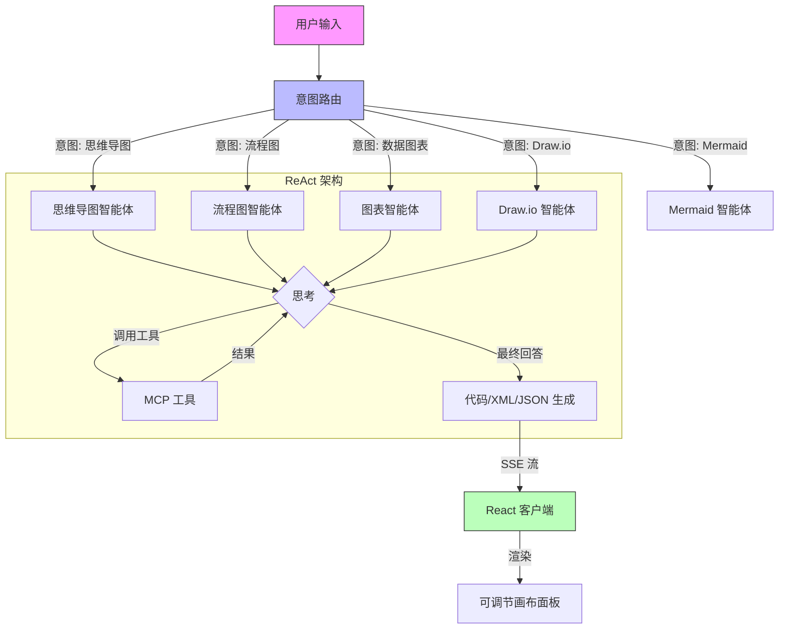

# DeepDiagram AI: 智能 AI 可视化平台

**DeepDiagram AI** 是一个开源的智能可视化平台，利用 **Agentic AI** 将自然语言转换为专业的图表。与传统工具不同，DeepDiagram 采用了多智能体架构，由专门的智能体处理不同的可视化领域——从交互式思维导图到复杂的数据图表。


---

## 🚀 功能特性

### 🧠 思维导图智能体 (Mind Map Agent)
- **核心驱动**: `mind-elixir`
- **能力**: 生成结构化的交互式思维导图。
- **工作流**: 支持实时预览并导出为 PNG。


### 🧜‍♂️ 流程图智能体 (Flowchart Agent)
- **核心驱动**: `React Flow`
- **能力**: 在现代交互式画布上创建详细的流程图。
- **工作流**: 支持自动布局和高质量图像导出。


### 📊 数据图表智能体 (Data Chart Agent)
- **核心驱动**: `Apache ECharts`
- **能力**: 使用柱状图、折线图、饼图等可视化数据。
- **工作流**: 分析数据或描述以生成丰富的 ECharts 配置。


### ✏️ Draw.io 智能体
- **核心驱动**: `Draw.io` (Atlas 主题)
- **能力**: 生成与 Draw.io 生态系统兼容的专业级技术图表。
- **工作流**: 具有 **自动居中** 和 **侧边栏隐藏** 功能的高级画布，提供专注的绘图体验。


### 🧜‍♀️ Mermaid 智能体
- **核心驱动**: `Mermaid.js` + `react-zoom-pan-pinch`
- **能力**: 生成复杂的图表，包括序列图、甘特图、时间线、状态图和类图。
- **工作流**: 原生交互式画布，支持自适应缩放、缩放/平移控制以及高分辨率 SVG/PNG 导出。


### 🤖 智能路由与多模态 (Intelligent Router & Multimodal)
- **上下文感知**: 基于 ReAct 的编排层，根据意图自动将请求路由到最佳智能体。
- **多模态**: 支持图像上传。上传白板照片或草图，DeepDiagram AI 即可将其数字化。

---

## ✨ 用户界面优化

- **现代聊天输入**: 重新设计的输入卡片，具有整洁的边框布局和底部对齐的操作按钮（回形针用于上传，发送用于提交）。
- **稳定布局**: 图像预览位于智能体快捷方式上方，确保工具栏在上传过程中保持固定且易于访问。
- **可调节布局**: 使用专业级的可拖动分隔符灵活调整绘图画布和聊天面板的宽度。
- **过程回溯操作 (Process Trace Actions)**:
  - **上下文渲染**: 直接从过程回溯中触发特定智能体的渲染。
  - **实时反馈**: 实时状态标签（例如“渲染失败”），在成功重新运行后立即清除。
  - **回溯日志**: 格式化的 JSON 日志，用于调试和提高透明度。

---

## 🏗 系统架构

DeepDiagram AI 使用 **React + FastAPI** 架构，并由 **LangGraph** 进行编排。更新通过 **SSE (Server-Sent Events)** 流式传输到前端，以实现实时预览体验。



---

## 🛠 技术栈

- **前端**: React 19, Vite, TypeScript, TailwindCSS, Zustand, React Flow, Mind-elixir, react-resizable-panels。
- **后端**: Python 3.10+, FastAPI, LangGraph, LangChain, DeepSeek/OpenAI。
- **包管理器**: `uv` (Python), `npm` (Node.js)。

---

## 🏁 快速开始

### 前提条件
- **Python**: 3.10 或更高版本
- **Node.js**: v18 或更高版本
- **uv**: `pip install uv`

### 1. 后端设置
```bash
cd backend
uv sync
bash start_backend.sh
```

### 2. 前端设置
```bash
cd frontend
npm install
npm run dev
```

访问 `http://localhost:5173` 开始使用 DeepDiagram AI。

---

## 📖 使用指南

1.  **自然语言与多模态**: 输入您的请求或上传图片（例如，“为用户登录创建一个流程图”）。
2.  **交互式画布**: 根据您的工作流程拖动并调整面板大小。
3.  **导出与分享**: 使用图表上方的工具栏下载为 PNG 或 SVG。
4.  **优化**: 要求 AI 调整结果（例如，“在流程中添加‘忘记密码’步骤”）。

---

## 🗺 路线图

- [x] 包含 3 个核心智能体 (思维导图、流程图、图表) 的 MVP
- [x] Draw.io 集成
- [x] 独立的 Mermaid 智能体
- [x] 可调节的任务栏布局
- [x] 增强的消息操作与复制逻辑
- [ ] 持久化会话与聊天历史管理
- [ ] 一键新建会话 (上下文重置)
- [ ] 增强型多模态：支持非图片文件 (PDF, Docx 等) 解析

---

## 📄 开源协议

本项目采用 **GNU Affero General Public License v3.0 (AGPL-3.0)** 协议。详情请参阅 [LICENSE](LICENSE) 文件。
